## Hệ thống quan trắc điều kiện môi trường nhà yến
<b><i>Đề tài Nghiên Cứu Khoa Học 2023 - 2024</i></b>
- <b>Người thực hiện: </b> 
  - Đặng Nguyễn Tiền Hậu (nhóm trưởng)
  - Ngô Hồng Toại
  - Nguyễn Trung Em
  - Nguyễn Thái Duy
- <b>Thời gian: </b>06/2023 - 04/2024
-----------------------
### Tổng quan về dự án
- Dự án là một đề tài nghiên cứu khoa học hướng tới việc kết hợp các kiến thức về lĩnh vực:
    + IoT (Internet of Things)
    + Website
để tạo ra các trạm quan trắc giám sát các thông số điều kiện môi trường nhà yến (phạm vi mà đề tài hướng đến là: nhiệt độ, độ ẩm, báo cháy)
- Dự án ngoài vai trò là một đề tài nghiên cứu thì chúng tôi mong muốn phát triển nó hơn, được đầu tư để có tiềm năng đưa ra thực tiễ, phát triển một cách đầy đủ và quy mô hơn. Đề tài có thể triển khai tại các nhà yến, nhà ở, cửa hàng bách hoá, vườn cây xanh để quan trắc môi trường tại nơi lắp đặt.

<h4>Một số hình ảnh của dự án</h4>
<h5>Hệ thống IoT</h5>

  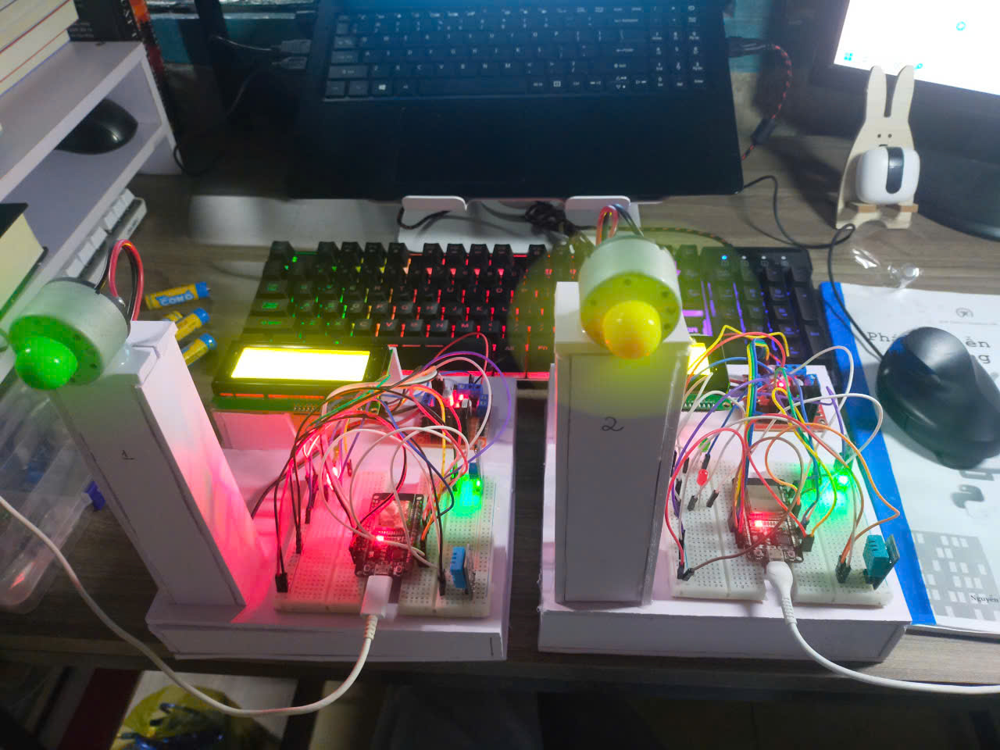
  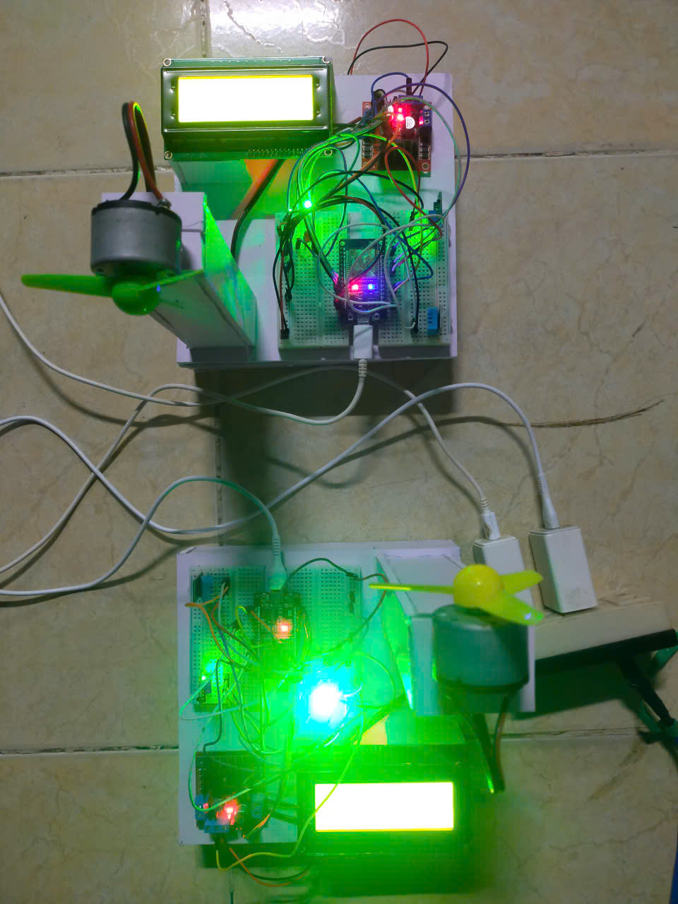
  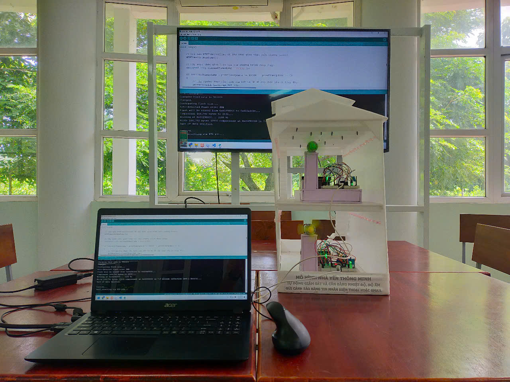

  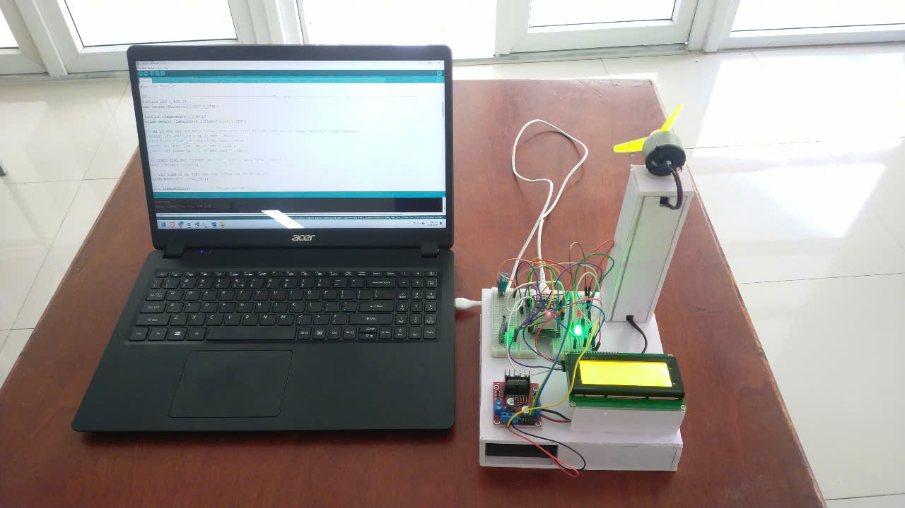
  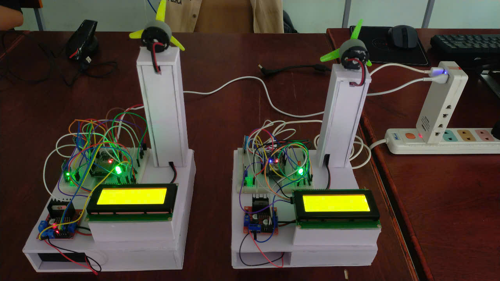
  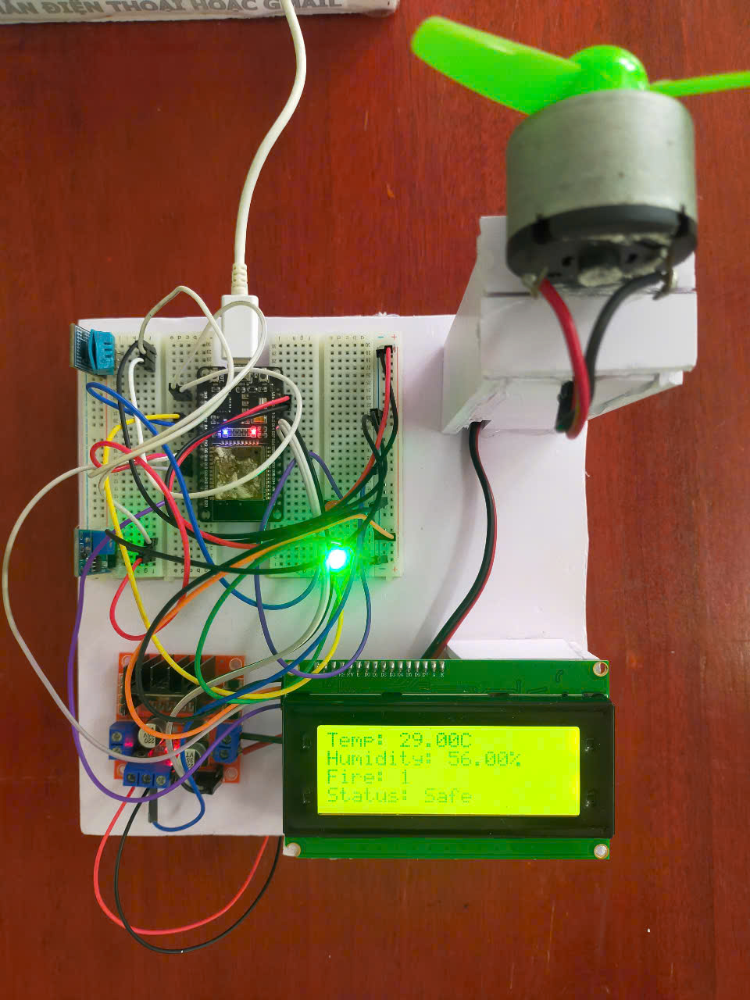

<h5>Website</h5>

  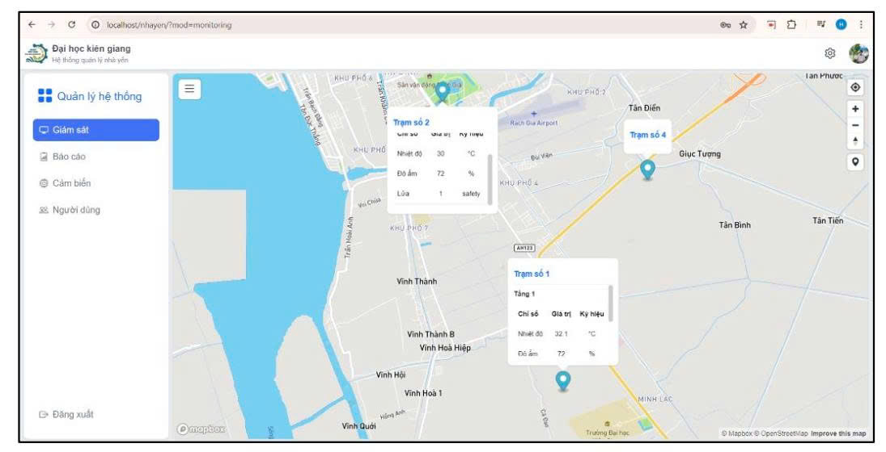
  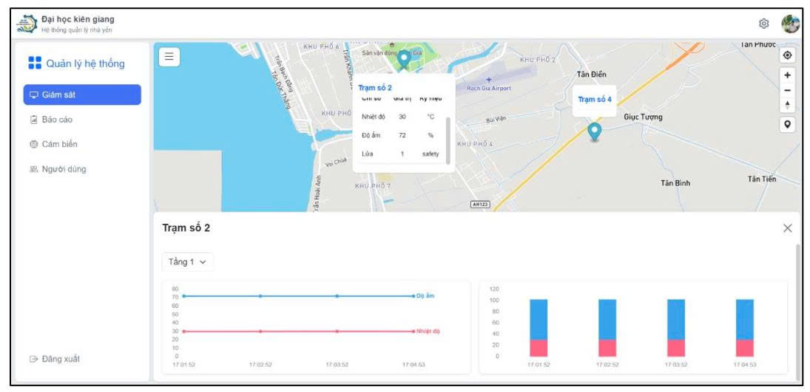
  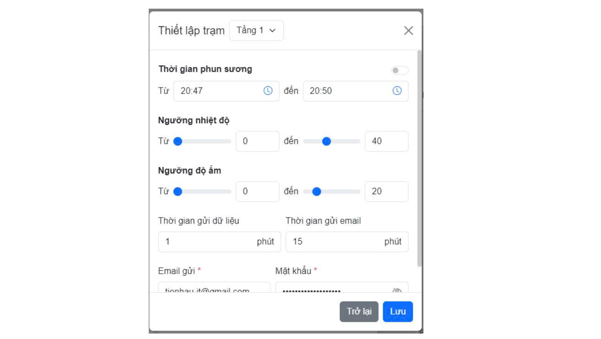

  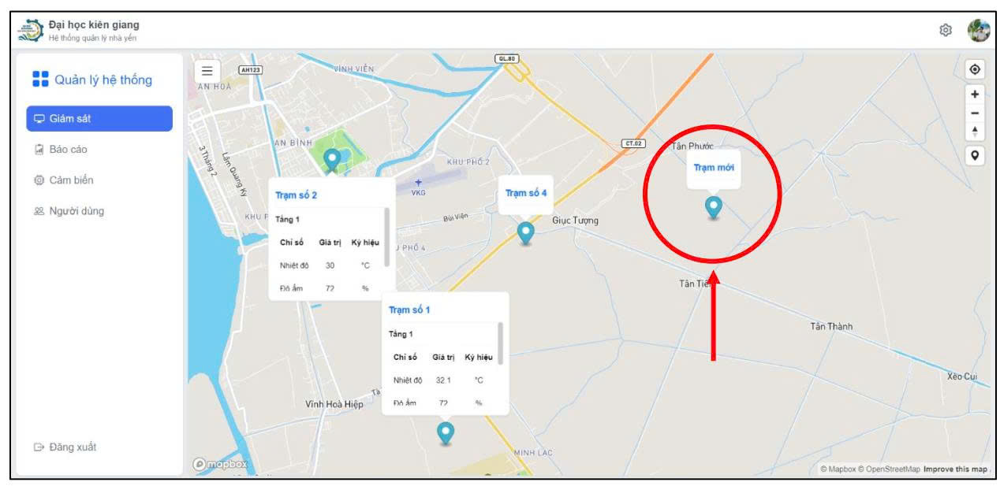
  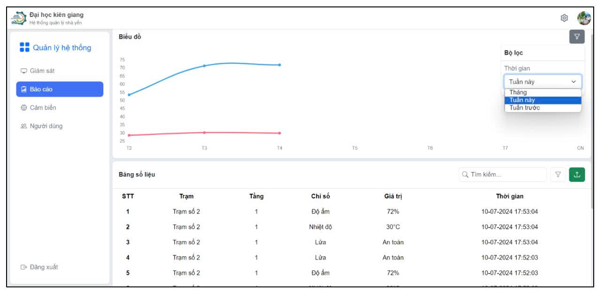
  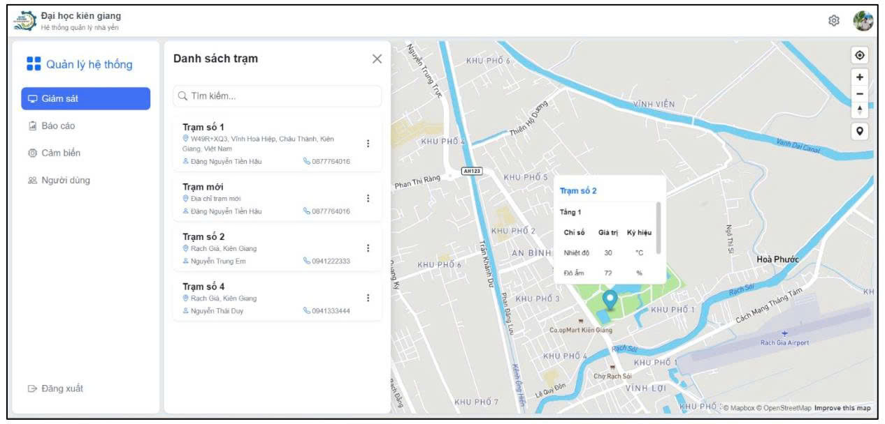

-----------------------
### Các tính năng chính
1. Đăng nhập và phân quyền (Quản trị cấp cao & nhân viên quản lý)
2. Quản lý các đối tượng cơ bản:
    - Quản lý (CRUD) tài khoản truy cập.
    - Quản lý (CRUD) thông tin nhân viên làm việc tại từng nhà yến.
    - Quản lý (CRUD) thiết bị, loại thiết bị và trạng thái thiết bị.
    - Quản lý (CRUD) toạ độ và thông tin từng trạm cảm biến được lắp đặt.
    - Quản lý (CRUD) các đơn vị đo được sử dụng.
3. Báo cáo, thống kê các thông tin:
    - Kết quả phân loại theo từng loại đơn vị (thông số), từng khung thời gian (tuần/tháng/năm), từng nhà yến.
    - Báo cáo chi tiết trong 1 nhà yến: cụm cảm biến nào, ở tầng nào, đơn vị nào.
    - Số lượng nhân viên làm việc tại từng khu vực phân loại.
4. Xem nhanh thông tin trực quan trên bản đồ:
    - Xem thông tin của trạm cảm biến: thiết bị, số đo hiện tại.
    - Vị trí trên bản đồ.
5. Chức năng khác:
    - Thiết lập hẹn giờ để bật/tắt thiết bị (phạm vi đề tài mô phỏng quạt phun sương)
    - Gửi Email cảnh báo nếu điều kiện môi trường bất thường.

-----------------------------------------------
### Kết quả
<b>Ưu diểm: </b>
- Hệ thống chạy demo ổn định khi được trình bày trước hội đồng.
- Phản biện tốt các câu hỏi của phản biện 1, 2 và các giảng viên khác.
- Hội đồng đánh giá loại đề tài: Tốt.

<b>Hạn chế: </b>
- Hệ thống chưa hoàn thiện 100%, vẫn còn nhiều sai lệch trong việc lấy giá trị thông số môi trường.
- Hệ thống chưa triển khai thật sự trong thực tế nên vẫn còn những vấn đề trong việc quản lý nhiều cụm cảm biến mà nhóm thực hiện chưa thấy được.

-----------------------------------------------
### Liên Hệ
Nếu bạn có bất kỳ câu hỏi nào hoặc muốn đóng góp cho dự án, hãy liên hệ với tôi qua:

- Email: [tienhau.it@gmail.com](mailto:tienhau.it@gmail.com)
- GitHub: [Thomas Dang](https://github.com/HauDNT)
- LinkedIn: [Hau Dang](https://www.linkedin.com/in/haudnt/)